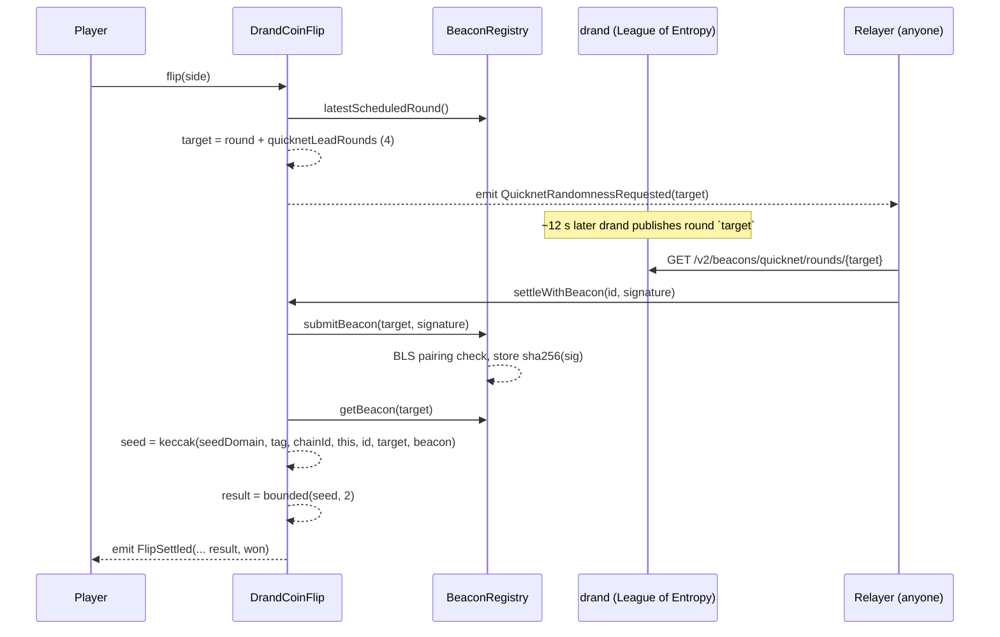

# drand Coin Flip

**A provably fair coin flip on Robinhood Chain Testnet, powered by the drand Quicknet beacon through
[Bas3d-Labs/drand-quicknet-evm](https://github.com/Bas3d-Labs/drand-quicknet-evm).**

The app is deliberately tiny so that the randomness pipeline is the whole story: a contract commits to a
*future* drand round, the round's BLS signature is verified on-chain by the registry, and the result is
derived from it. Anyone can re-derive every result from public data, and the dashboard does exactly that
in the browser.

| | |
|---|---|
| Live contract | [`0x2fA62BBd6a2c454346B617EC881E413f31713A0B`](https://explorer.testnet.chain.robinhood.com/address/0x2fA62BBd6a2c454346B617EC881E413f31713A0B) (source verified) |
| Beacon registry | [`0xB1e8bc94AdBb82F036aafC2Af004986F810dd0fe`](https://explorer.testnet.chain.robinhood.com/address/0xB1e8bc94AdBb82F036aafC2Af004986F810dd0fe) — codehash `0x6d84157b…0e73` |
| Beacon verifier | [`0xAe9a1AbF0D30633ec1Eb73038F375b2c7Ee0E01e`](https://explorer.testnet.chain.robinhood.com/address/0xAe9a1AbF0D30633ec1Eb73038F375b2c7Ee0E01e) — codehash `0x916ebb69…8aab` |
| Base contract | [`DrandQuicknetRandomnessConsumer`](https://github.com/Bas3d-Labs/drand-quicknet-evm/blob/main/contracts/src/consumers/DrandQuicknetRandomnessConsumer.sol) from drand-quicknet-evm `b0f84b4` (git submodule) |
| Chain | Robinhood Chain Testnet, id `46630`, RPC `https://rpc.testnet.chain.robinhood.com` |
| Randomness | [drand Quicknet](https://drand.love) — one BLS12-381 signature every 3 s, chain hash `52db9ba7…4e971` |

---

## Contents

1. [How we use drand-quicknet-evm](#1-how-we-use-drand-quicknet-evm)
2. [Repository layout](#2-repository-layout)
3. [Run it yourself](#3-run-it-yourself)
4. [Verifying a result by hand](#4-verifying-a-result-by-hand)
5. [Considerations and open questions before you integrate](#5-considerations-and-open-questions-before-you-integrate)
6. [Using drand-quicknet-evm in your own contract](#6-using-drand-quicknet-evm-in-your-own-contract)

---

## 1. How we use drand-quicknet-evm

`drand-quicknet-evm` is **not a VRF**. There is no request, no callback and no oracle that answers you.
It is a permissionless, write-once cache of *verified* drand beacons:

- Anyone calls `submitBeacon(round, signature)` with the 48-byte compressed G1 signature drand publishes
  for that round.
- A codehash-pinned verifier checks it with a BLS12-381 pairing (EIP-2537) against the hard-coded Quicknet
  public key.
- On success the registry stores `sha256(signature)` for the round. No owner, no setter, no overwrite.

The consumer pattern is therefore **commit to a round, settle from it**. `DrandCoinFlip.sol` inherits
[`DrandQuicknetRandomnessConsumer`](contracts/lib/drand-quicknet-evm/contracts/src/consumers/DrandQuicknetRandomnessConsumer.sol),
the reusable base contract from drand-quicknet-evm, which owns every registry-facing concern:

| Concern | Handled by the base contract |
|---|---|
| Registry authentication | Constructor reverts unless `registry.codehash == expectedRegistryCodehash` (from the upstream deployment manifest) |
| Lead floor | Constructor reverts if `leadRounds < registry.minimumLeadRounds()` |
| Round commitment | `_requestQuicknetRandomness()` returns `latestScheduledRound() + quicknetLeadRounds` and emits `QuicknetRandomnessRequested(round)` |
| Reads / liveness | `_isQuicknetBeaconStored`, `_getQuicknetBeacon`, `_submitQuicknetBeacon` (same round only) |
| Seed derivation | `_deriveQuicknetSeed(appDomain, uniqueRequestId, round, randomness)` with a fixed outer domain |

The coin flip itself is ~80 lines on top of that:



### Commit — [`flip()`](contracts/src/DrandCoinFlip.sol)

```solidity
uint64 target = _requestQuicknetRandomness();   // latestScheduledRound() + quicknetLeadRounds; contract-derived, never caller-supplied
```

The player picks only a side. The round comes from the block timestamp plus a fixed lead, so at commit
time the beacon does not exist yet. `quicknetLeadRounds` is an immutable set by the base constructor, which
refuses anything below `registry.minimumLeadRounds()`. The deploy script re-checks it, plus the registry
and verifier codehashes, before spending gas.

### Settle — [`settle()` / `settleWithBeacon()`](contracts/src/DrandCoinFlip.sol)

- Permissionless. Whoever calls it, the payout goes to the player and the outcome is the same.
- Requires `_isQuicknetBeaconStored(target)`. If the beacon is not imported yet the call reverts and the flip
  stays pending. **The round is never substituted.**
- `settleWithBeacon(id, sig)` wraps `_submitQuicknetBeacon` for the *committed* round and settles in one
  transaction so a relayer or the player can do it with one click. It is a liveness path, not a choice.
- The seed comes from the base contract's `_deriveQuicknetSeed(DOMAIN_TAG, bytes32(id), round, randomness)`:
  `keccak256(abi.encode(QUICKNET_SEED_DOMAIN, DOMAIN_TAG, block.chainid, address(this), bytes32(id), round, randomness))`.
  The same beacon is stored identically on every chain that imports it, so chain id and contract address
  are in the seed; the flip id is the unique request id the base contract requires.
- Heads/Tails is drawn with rejection sampling (`bounded(seed, 2)`), not `seed % n`.

### Relaying — three layers so a flip always settles

The integration notes are explicit that the *player must not be the only relayer*, and that settlement
timing must not be a free option for the player. We use:

1. **Client nudge** — when the countdown hits zero the page calls `POST /api/settle`, a Next.js route that
   fetches the signature and sends `settleWithBeacon` from a server-side key. Idempotent; retries nonce
   collisions because serverless invocations overlap.
2. **Cron sweep** — `GET /api/sweep` on Vercel Cron settles anything left behind (tab closed, nudge failed).
3. **Reveal button** — the player (or anyone) can always settle from their own wallet.

A standalone [`relayer/index.mjs`](relayer/index.mjs) does the same job as a long-running process for
self-hosting. Because the contract implements `IDrandQuicknetRandomnessConsumer` (the base contract emits
`QuicknetRandomnessRequested(round)` and exposes `quicknetBeaconRegistry()`), the reference relayer daemon in
`drand-quicknet-evm/apps/relayer` also services it with `QUICKNET_CONSUMERS=<address>` — verified live, see §6.5.

### Verification — what the dashboard checks

For every settled flip the browser fetches the round from drand's public API and checks three things,
using nothing but public inputs:

1. `sha256(signature)` equals the `randomness` the contract recorded (and equals `registry.getBeacon(round)`).
2. `keccak256(abi.encode(seedDomain, tag, 46630, contract, bytes32(id), round, randomness))` equals the recorded `seed`.
3. `bounded(seed, 2)` equals the recorded result.

Note that `sha256(signature)` is also exactly the `randomness` field drand itself publishes in its v1 API,
so the registry value can be cross-checked against drand without touching the chain at all.

---

## 2. Repository layout

```
contracts/   Foundry: DrandCoinFlip.sol (extends DrandQuicknetRandomnessConsumer), unit tests (mock registry),
             fork tests against the real registry + BLS verifier, Deploy.s.sol with safety assertions
contracts/lib/drand-quicknet-evm/   upstream submodule — base contract, interfaces, deployment manifest
web/         Next.js (App Router) + wagmi/viem: Flip page, Dashboard, /api/settle, /api/sweep, vercel.json cron
relayer/     Standalone relayer for self-hosting
scripts/     sync-abi (contracts -> web), sync-deployment (forge broadcast -> web config)
docs/        integration-notes.md — the security-review notes this integration follows
```

---

## 3. Run it yourself

### Prerequisites

- Node 20+ and pnpm
- [Foundry](https://book.getfoundry.sh/getting-started/installation)
- Testnet ETH from the [Robinhood faucet](https://faucet.testnet.chain.robinhood.com/). Gas is very cheap:
  deploying cost ~0.00001 ETH and a settlement that imports a beacon is ~0.7M gas.

```bash
git clone --recurse-submodules <this repo> && cd coinflip   # forge-std and drand-quicknet-evm are submodules
pnpm install
```

### 3.1 Contracts

```bash
cd contracts
forge test                                                          # unit tests against a mock registry
forge test --match-contract Fork --fork-url robinhood_testnet -vv   # against the REAL registry + verifier
```

The fork tests submit a genuine past-round signature and assert it is stored, assert a wrong-round
signature and a sign-bit-flipped signature are rejected, and assert the consumer refuses to bind to the
superseded registry (different codehash). `foundry.toml` sets `evm_version = "prague"`; without it the
BLS precompile does not exist locally and every submission reverts. `solc` is pinned to `0.8.36` to match
the upstream `pragma`.

Deploy. The script refuses to run unless the live registry codehash, `verifier()`, `verifierCodehash()`,
the live verifier bytecode hash and `minimumLeadRounds()` all match what is pinned in it (taken from
`lib/drand-quicknet-evm/deployments/robinhood-testnet.json`). The base constructor then checks the registry
codehash a second time on-chain:

```bash
cp .env.example .env                        # DEPLOYER_PRIVATE_KEY=..., or use --account <foundry keystore>
forge script script/Deploy.s.sol --rpc-url robinhood_testnet --broadcast --private-key $DEPLOYER_PRIVATE_KEY
cd .. && pnpm sync-deployment               # writes address + block into web/src/config/deployments.json
```

Verify source on Blockscout:

```bash
cd contracts && forge verify-contract <ADDRESS> src/DrandCoinFlip.sol:DrandCoinFlip \
  --verifier blockscout --verifier-url https://explorer.testnet.chain.robinhood.com/api \
  --constructor-args $(cast abi-encode 'constructor(address,bytes32,uint64)' \
      0xB1e8bc94AdBb82F036aafC2Af004986F810dd0fe 0x6d84157b97cfea3d51931f84f17638028dff7560d9be1f07c9d668fa37480e73 4)
```

### 3.2 Web app

```bash
cp web/.env.example web/.env.local          # set RELAYER_PRIVATE_KEY and CRON_SECRET (see below)
pnpm dev                                    # http://localhost:3000
```

| Variable | Where | Purpose |
|---|---|---|
| `RELAYER_PRIVATE_KEY` | server only | Signs `settleWithBeacon` for `/api/settle` and `/api/sweep`. Unset = server settlement disabled, users Reveal themselves. |
| `CRON_SECRET` | server only | Protects `/api/sweep`. Vercel sends it automatically as `Authorization: Bearer …`. |
| `RELAYER_RPC_URL` | server only | Optional private RPC for the relayer. |
| `NEXT_PUBLIC_COINFLIP_ADDRESS` | public | Overrides the address in `deployments.json`. |
| `NEXT_PUBLIC_RPC_URL`, `NEXT_PUBLIC_DEV_PRIVATE_KEY` | dev only | Local anvil fork + a wallet-less burner connector. Ignored in production builds. |

### 3.3 Standalone relayer (optional)

```bash
cp relayer/.env.example relayer/.env        # RELAYER_PRIVATE_KEY, COINFLIP_ADDRESS
pnpm relayer
```

### 3.4 Fully local, no testnet ETH

```bash
anvil --fork-url https://rpc.testnet.chain.robinhood.com --hardfork prague
cd contracts && forge script script/Deploy.s.sol --rpc-url http://127.0.0.1:8545 --broadcast \
  --private-key 0xac0974bec39a17e36ba4a6b4d238ff944bacb478cbed5efcae784d7bf4f2ff80
rm -rf broadcast/Deploy.s.sol/46630         # keep the fork deploy out of sync-deployment
```

`web/.env.local`:

```
NEXT_PUBLIC_RPC_URL=http://127.0.0.1:8545
NEXT_PUBLIC_DEV_PRIVATE_KEY=0xac0974bec39a17e36ba4a6b4d238ff944bacb478cbed5efcae784d7bf4f2ff80
NEXT_PUBLIC_COINFLIP_ADDRESS=<address printed by the script>
RELAYER_PRIVATE_KEY=0x59c6995e998f97a5a0044966f0945389dc9e86dae88c7a8412f4603b6b78690d
RELAYER_RPC_URL=http://127.0.0.1:8545
```

Real drand rounds are fetched and verified by the real registry and verifier bytecode on the fork.
Connect with "Dev burner" and flip.

---

## 4. Verifying a result by hand

Take flip `#0` on the live contract (round `32113200`, settled Tails):

```bash
RPC=https://rpc.testnet.chain.robinhood.com
CF=0x2fA62BBd6a2c454346B617EC881E413f31713A0B
REG=0xB1e8bc94AdBb82F036aafC2Af004986F810dd0fe

# 1. what the contract recorded
cast call $CF 'getFlip(uint256)((address,uint8,uint8,bool,uint64,uint64,uint64,bytes32,bytes32))' 0 --rpc-url $RPC

# 2. drand's signature for that round, hashed
SIG=$(curl -s https://api.drand.sh/v2/beacons/quicknet/rounds/32113200 | jq -r .signature)
echo -n $SIG | xxd -r -p | shasum -a 256          # == randomness in step 1 == registry value below
cast call $REG 'getBeacon(uint64)(bytes32)' 32113200 --rpc-url $RPC

# 3. the seed and the result
cast call $CF 'computeSeed(uint256,uint64,bytes32)(bytes32)' 0 32113200 0x<randomness> --rpc-url $RPC
cast call $CF 'bounded(bytes32,uint256)(uint256)' 0x<seed> 2 --rpc-url $RPC   # 0 = Heads, 1 = Tails
```

---

## 5. Considerations and open questions before you integrate

Everything below is covered in depth in [`docs/integration-notes.md`](docs/integration-notes.md). Read it
in full before shipping anything with value at stake. The short version:

**Nobody answers your request.** There is no callback. If no one imports the target round, the
commitment stays pending forever. Decide who runs and funds your relayer, and what happens to a
commitment nobody settles. Any escape hatch must be non-user-triggerable and outcome-independent.

**The lead is the only security parameter.** A round's beacon is public at a known wall-clock time,
but your contract measures the lead against `block.timestamp`, which the sequencer may run behind.
If the chain lags more than `(LEAD_ROUNDS − 1) · 3` s, the beacon is already public when the commit
lands and an attacker can commit only on wins. We use 4 rounds for a no-value demo; use **≥ 10** with
money on it and size for the worst observed lag, not the median. `minimumLeadRounds()` is advisory,
the registry does not enforce it.

**Derive the round from the clock, never from the registry.** Submission is permissionless, so an
adversary controls which rounds are stored and when. Never choose "the latest stored round" or fall
back to `R+1` when `R` is missing. Settle from exactly the committed round or stay pending.

**No selective abort.** Once committed, the user must not be able to cancel or refund after the
result is knowable.

**Pin inputs and separate seeds.** Fix every outcome-affecting input at commit and read it from storage
at settle. Seeds must include a purpose tag, `block.chainid`, `address(this)`, the commitment id and the
draw index, because the same beacon is stored identically on every chain. Draw bounded values with
rejection sampling, not `seed % n`.

**Someone pays ~680k gas per round import.** Later readers pay two SLOADs. Decide whether the player,
your relayer, or both pay, and what happens when the relayer wallet runs dry. This app falls back to the
user's wallet.

**Relayer details that bit us.** One key cannot send concurrent transactions, so serialize or retry on
nonce errors; simulate first and treat `AlreadySettled` as success; keep a fallback drand mirror
(`api2.drand.sh`, `api3.drand.sh`); gate on `gasleft()` before any external call whose failure you catch.

**Trust you inherit.** drand's threshold committee, the sequencer's clock, and the registry deployment
you point at. Verify the registry rather than copying its address: `verifier()`, `verifierCodehash()`
against the live verifier code, and a bytecode diff against the pinned commits. The base contract's
codehash check turns a wrong registry address into a constructor revert, but it is only as good as the
codehash you feed it — take it from the upstream manifest, not from the chain. The chain must have the
Prague BLS precompiles, and there is no mainnet registry yet.

**Questions for the registry maintainers.** Mainnet deployment timeline and chains, whether public
relayers will be operated, whether `minimumLeadRounds()` will ever be enforced on `submitBeacon`, and
the expected behaviour if drand pauses or skips a round.

---

## 6. Using drand-quicknet-evm in your own contract

This is the shortest path from "I need unpredictable randomness" to a deployed consumer, using the
[`DrandQuicknetRandomnessConsumer`](contracts/lib/drand-quicknet-evm/contracts/src/consumers/DrandQuicknetRandomnessConsumer.sol)
base contract. Everything in this section is exactly what `DrandCoinFlip.sol` does, minus the game.

### 6.1 Install

```bash
git submodule add https://github.com/Bas3d-Labs/drand-quicknet-evm contracts/lib/drand-quicknet-evm
```

`foundry.toml`:

```toml
solc_version = "0.8.36"      # the upstream contracts use `pragma solidity 0.8.36`
evm_version  = "prague"      # BLS12-381 precompiles (EIP-2537); required for fork tests
remappings   = ["drand-quicknet-evm/=lib/drand-quicknet-evm/contracts/src/"]
```

### 6.2 Inherit the base contract

```solidity
import {DrandQuicknetRandomnessConsumer} from "drand-quicknet-evm/consumers/DrandQuicknetRandomnessConsumer.sol";

contract MyGame is DrandQuicknetRandomnessConsumer {
    bytes32 public constant DOMAIN_TAG = keccak256("MY_GAME_DRAW_V1"); // one per randomness-consuming feature

    struct Request { address player; uint64 round; bool settled; /* ...inputs fixed at commit... */ }
    Request[] public requests;

    constructor(address registry, bytes32 registryCodehash, uint64 leadRounds)
        DrandQuicknetRandomnessConsumer(registry, registryCodehash, leadRounds)
    {}

    function play() external returns (uint256 id) {
        uint64 round = _requestQuicknetRandomness();          // commit to an exact future round, emits QuicknetRandomnessRequested
        id = requests.length;
        requests.push(Request({player: msg.sender, round: round, settled: false}));
    }

    function settle(uint256 id) public {                     // permissionless
        Request storage r = requests[id];
        require(!r.settled, "settled");
        require(_isQuicknetBeaconStored(r.round), "beacon not imported yet"); // retryable, never grounds for a new round
        bytes32 randomness = _getQuicknetBeacon(r.round);
        bytes32 seed = _deriveQuicknetSeed(DOMAIN_TAG, bytes32(id), r.round, randomness);
        r.settled = true;
        // ...derive the outcome from `seed` and state stored at commit; pay r.player regardless of msg.sender...
    }

    /// Liveness path: import the beacon for the *committed* round and settle in one tx.
    function settleWithBeacon(uint256 id, bytes calldata signature) external {
        _submitQuicknetBeacon(requests[id].round, signature);   // registry does the BLS check; reverts on a bad signature
        settle(id);
    }
}
```

The base constructor does four things you would otherwise have to get right yourself:

| Check | Effect |
|---|---|
| `registry.code.length != 0` | reverts `InvalidQuicknetBeaconRegistry` |
| `registry.codehash == registryCodehash` | reverts `InvalidQuicknetBeaconRegistryCodehash` — a wrong or swapped registry cannot be bound |
| `leadRounds != 0` | reverts `InvalidQuicknetLeadRounds` |
| `leadRounds >= registry.minimumLeadRounds()` | reverts `QuicknetLeadBelowRegistryMinimum` |

What it gives you afterwards:

| Member | Purpose |
|---|---|
| `_requestQuicknetRandomness() → round` | `latestScheduledRound() + quicknetLeadRounds`; emits `QuicknetRandomnessRequested(round)` |
| `_isQuicknetBeaconStored(round)` | is the exact round cached |
| `_getQuicknetBeacon(round)` | `sha256(signature)` for the round; reverts if missing |
| `_submitQuicknetBeacon(round, sig)` | permissionless import of the *same* round; idempotent once stored |
| `_deriveQuicknetSeed(domain, requestId, round, randomness)` | `keccak256(abi.encode(QUICKNET_SEED_DOMAIN, domain, chainid, this, requestId, round, randomness))` |
| `quicknetBeaconRegistry()`, `quicknetBeaconRegistryCodehash()`, `quicknetLeadRounds()` | public immutables, so anyone can audit the binding |

### 6.3 Rules the base contract cannot enforce for you

1. **Persist the round `_requestQuicknetRandomness()` returns and settle from that round only.** Never
   overwrite it, never fall back to a neighbouring round if it is missing. A missing round is a liveness
   problem, not a reason to reroll.
2. **`uniqueRequestId` must be unique per request within a domain.** Use an incrementing id
   (`bytes32(id)`), never the round, the caller or a constant. Two requests in the same block share a
   round; the id is what separates their seeds.
3. **Fix every outcome-affecting input at commit** and read it from storage at settle.
4. **Keep `settle` permissionless** and pay the committed player whoever calls it. No user-triggerable
   cancel or refund after commit.
5. **Draw bounded values with rejection sampling**, not `seed % n` (one bit, as in a coin flip, is exact).
6. **Size the lead for your chain's clock lag.** `minimumLeadRounds()` is the registry's floor, not a
   recommendation; we use 4 for a no-value demo and would use ≥ 10 with money at stake. See §5.

### 6.4 Deploy

Take the registry address **and codehash** from the upstream manifest, never from the chain you are
deploying to:

```bash
cat contracts/lib/drand-quicknet-evm/deployments/robinhood-testnet.json
```

Pin them as constants in your deploy script and assert against the live chain before broadcasting, as
[`Deploy.s.sol`](contracts/script/Deploy.s.sol) does: registry codehash, `verifier()`, `verifierCodehash()`,
the live verifier codehash and `minimumLeadRounds()`. The base constructor then re-checks the registry
codehash on-chain, so a mistake here fails loudly instead of deploying a consumer bound to the wrong thing.

### 6.5 Get your rounds imported

Nobody imports a beacon unless someone asks. Because the base contract emits
`QuicknetRandomnessRequested(round)` and exposes `quicknetBeaconRegistry()`, your contract is a valid
`IDrandQuicknetRandomnessConsumer` and any of these work; we run all three against this repo's contract:

| Relayer | What it does | Verified against `0x2fA6…3A0B` |
|---|---|---|
| **Reference daemon** in `drand-quicknet-evm/apps/relayer` | Watches your consumer's request events, imports the exact round into the registry. You still call `settle()` (or let anyone). | Yes — `QUICKNET_CONSUMERS=<address>`, daemon imported round `32113702` ~15 s after the commit; flip #2 then settled with plain `settle()` |
| **Your own settler** (`relayer/index.mjs`, `web/src/server/relayer.ts`) | Fetches the signature from `api.drand.sh` and calls your `settleWithBeacon` — import and settle in one tx | Yes — flip #1 settled by `relayer/index.mjs`; flip #3 by `POST /api/settle` |
| **The player** | Same call from their wallet ("Reveal") | Yes — flip #0 |

Reference daemon setup, from the upstream repo root:

```dotenv
PRIVATE_KEY=0x...                                 # low-value courier key, only pays gas
QUICKNET_RPC_URL=https://rpc.testnet.chain.robinhood.com
QUICKNET_CONSUMERS=0xYourConsumer                 # comma-separated
QUICKNET_START_BLOCK=<your deploy block>
QUICKNET_CHECKPOINT_FILE=.state/quicknet-relayer.json
```

```bash
pnpm install && pnpm build:quicknet && pnpm build:registry-sdk && pnpm build:relayer
pnpm --filter @based-labs/drand-quicknet-relayer start daemon \
  --network-config networks/examples/robinhood-testnet-custom.json
```

The daemon validates the registry codehash from the network descriptor on start and refuses consumers
whose `quicknetBeaconRegistry()` does not match. It only imports; it never settles or picks rounds.

### 6.6 Let users verify you

Everything needed to re-derive a result is public. In JavaScript with viem
([`web/src/lib/drand.ts`](web/src/lib/drand.ts)):

```ts
const sig = (await fetch(`https://api.drand.sh/v2/beacons/quicknet/rounds/${round}`).then(r => r.json())).signature
const randomness = sha256(hexToBytes(sig))                       // == registry.getBeacon(round)
const seed = keccak256(encodeAbiParameters(
  [{type:'bytes32'},{type:'bytes32'},{type:'uint256'},{type:'address'},{type:'bytes32'},{type:'uint64'},{type:'bytes32'}],
  [keccak256(toBytes('based-labs.drand-quicknet.consumer.seed.v1')), DOMAIN_TAG, chainId, contract, pad(id), round, randomness]))
```

Expose a `computeSeed(id, round, randomness)` view (as this repo does) so `cast call` users can check
the same thing without reimplementing the encoding.

### 6.7 Test

- **Unit tests** against a mock registry: pass `address(mock).codehash` as the expected codehash. Cover
  the four constructor reverts, exact-round settlement with neighbouring rounds present, the idempotent
  beacon submit, and seed uniqueness across ids and rounds ([`DrandCoinFlip.t.sol`](contracts/test/DrandCoinFlip.t.sol)).
- **Fork tests** against the real registry and BLS verifier: a genuine signature stores, a wrong-round
  signature and a sign-bit-flipped one revert, and the consumer refuses a registry with a different
  codehash ([`DrandCoinFlip.fork.t.sol`](contracts/test/DrandCoinFlip.fork.t.sol)).

---

Built on [Bas3d-Labs/drand-quicknet-evm](https://github.com/Bas3d-Labs/drand-quicknet-evm) and
[drand](https://drand.love). Robinhood Chain docs: <https://docs.robinhood.com/chain>.
