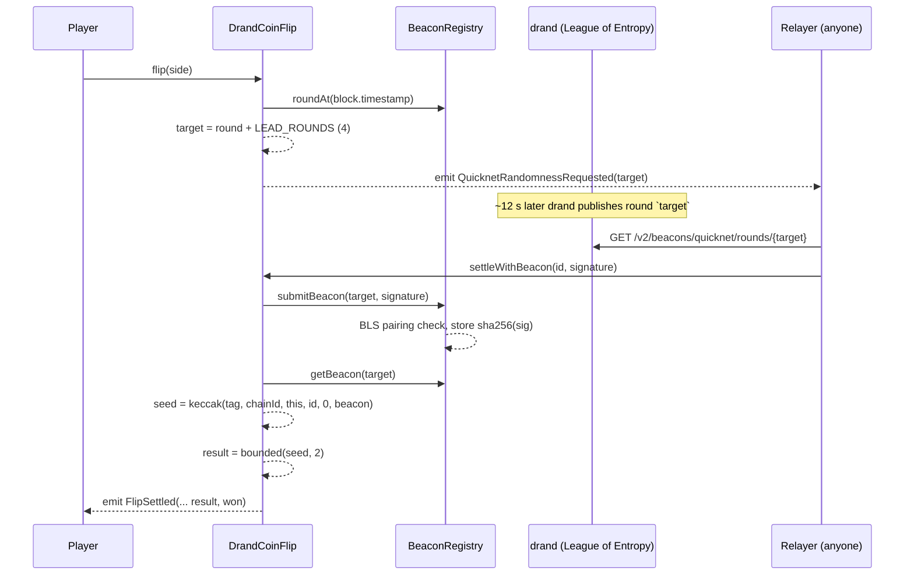

# drand Coin Flip

**A provably fair coin flip on Robinhood Chain Testnet, powered by the drand Quicknet beacon through
[Bas3d-Labs/drand-quicknet-evm](https://github.com/Bas3d-Labs/drand-quicknet-evm).**

The app is deliberately tiny so that the randomness pipeline is the whole story: a contract commits to a
*future* drand round, the round's BLS signature is verified on-chain by the registry, and the result is
derived from it. Anyone can re-derive every result from public data, and the dashboard does exactly that
in the browser.

| | |
|---|---|
| Live contract | [`0xa7E13fE13245c18732F40A342263d4949c728022`](https://explorer.testnet.chain.robinhood.com/address/0xa7E13fE13245c18732F40A342263d4949c728022) (source verified) |
| Beacon registry | [`0x6e69C56D8D678aDeF8401adF1186c026A0915e2a`](https://explorer.testnet.chain.robinhood.com/address/0x6e69C56D8D678aDeF8401adF1186c026A0915e2a) |
| Chain | Robinhood Chain Testnet, id `46630`, RPC `https://rpc.testnet.chain.robinhood.com` |
| Randomness | [drand Quicknet](https://drand.love) — one BLS12-381 signature every 3 s, chain hash `52db9ba7…4e971` |

---

## Contents

1. [How we use drand-quicknet-evm](#1-how-we-use-drand-quicknet-evm)
2. [Repository layout](#2-repository-layout)
3. [Run it yourself](#3-run-it-yourself)
4. [Verifying a result by hand](#4-verifying-a-result-by-hand)
5. [Considerations and open questions before you integrate](#5-considerations-and-open-questions-before-you-integrate)
6. [Adapting this for your own app](#6-adapting-this-for-your-own-app)

---

## 1. How we use drand-quicknet-evm

`drand-quicknet-evm` is **not a VRF**. There is no request, no callback and no oracle that answers you.
It is a permissionless, write-once cache of *verified* drand beacons:

- Anyone calls `submitBeacon(round, signature)` with the 48-byte compressed G1 signature drand publishes
  for that round.
- A codehash-pinned verifier checks it with a BLS12-381 pairing (EIP-2537) against the hard-coded Quicknet
  public key.
- On success the registry stores `sha256(signature)` for the round. No owner, no setter, no overwrite.

The consumer pattern is therefore **commit to a round, settle from it**. This is what `DrandCoinFlip.sol` does:



### Commit — [`flip()`](contracts/src/DrandCoinFlip.sol)

```solidity
uint64 target = registry.roundAt(block.timestamp) + LEAD_ROUNDS;   // contract-derived, never caller-supplied
```

The player picks only a side. The round comes from the block timestamp plus a fixed lead, so at commit
time the beacon does not exist yet. `LEAD_ROUNDS` is an immutable checked against
`registry.minimumLeadRounds()` in the constructor **and** in the deploy script.

### Settle — [`settle()` / `settleWithBeacon()`](contracts/src/DrandCoinFlip.sol)

- Permissionless. Whoever calls it, the payout goes to the player and the outcome is the same.
- Requires `registry.isStored(target)`. If the beacon is not imported yet the call reverts and the flip
  stays pending. **The round is never substituted.**
- `settleWithBeacon(id, sig)` is a convenience that imports and settles in one transaction so a relayer
  or the player can do it with one click.
- The seed is domain-separated: `keccak256(abi.encode(DOMAIN_TAG, block.chainid, address(this), id, uint16(0), randomness))`.
  The same beacon is stored identically on every chain that imports it, so chain id and contract address
  must be in the seed.
- Heads/Tails is drawn with rejection sampling (`bounded(seed, 2)`), not `seed % n`.

### Relaying — three layers so a flip always settles

The integration notes are explicit that the *player must not be the only relayer*, and that settlement
timing must not be a free option for the player. We use:

1. **Client nudge** — when the countdown hits zero the page calls `POST /api/settle`, a Next.js route that
   fetches the signature and sends `settleWithBeacon` from a server-side key. Idempotent; retries nonce
   collisions because serverless invocations overlap.
2. **Cron sweep** — `GET /api/sweep` on Vercel Cron settles anything left behind (tab closed, nudge failed).
3. **Reveal button** — the player (or anyone) can always settle from their own wallet.

A standalone [`relayer/index.mjs`](relayer/index.mjs) does the same job as a long-running process for
self-hosting. The contract also emits `QuicknetRandomnessRequested(round)`, so the reference relayer daemon
in `drand-quicknet-evm/apps/relayer` works unchanged.

### Verification — what the dashboard checks

For every settled flip the browser fetches the round from drand's public API and checks three things,
using nothing but public inputs:

1. `sha256(signature)` equals the `randomness` the contract recorded (and equals `registry.getBeacon(round)`).
2. `keccak256(abi.encode(tag, 46630, contract, id, 0, randomness))` equals the recorded `seed`.
3. `bounded(seed, 2)` equals the recorded result.

Note that `sha256(signature)` is also exactly the `randomness` field drand itself publishes in its v1 API,
so the registry value can be cross-checked against drand without touching the chain at all.

---

## 2. Repository layout

```
contracts/   Foundry: DrandCoinFlip.sol, IDrandQuicknetBeaconRegistry.sol, unit tests (mock registry),
             fork tests against the real registry + BLS verifier, Deploy.s.sol with safety assertions
web/         Next.js (App Router) + wagmi/viem: Flip page, Dashboard, /api/settle, /api/sweep, vercel.json cron
relayer/     Standalone relayer for self-hosting
scripts/     sync-abi (contracts -> web), sync-deployment (forge broadcast -> web config)
docs/        integration-notes.md — the security-review notes this integration follows
```

---

## 3. Run it yourself

### Prerequisites

- Node 20+ and pnpm
- [Foundry](https://book.getfoundry.sh/getting-started/installation)
- Testnet ETH from the [Robinhood faucet](https://faucet.testnet.chain.robinhood.com/). Gas is very cheap:
  deploying cost ~0.00001 ETH and a settlement that imports a beacon is ~0.7M gas.

```bash
git clone --recurse-submodules <this repo> && cd coinflip   # forge-std is a submodule
pnpm install
```

### 3.1 Contracts

```bash
cd contracts
forge test                                                          # unit tests against a mock registry
forge test --match-contract Fork --fork-url robinhood_testnet -vv   # against the REAL registry + verifier
```

The fork tests submit a genuine past-round signature and assert it is stored, and assert a wrong-round
signature and a sign-bit-flipped signature are rejected. `foundry.toml` sets `evm_version = "prague"`;
without it the BLS precompile does not exist locally and every submission reverts.

Deploy. The script refuses to run unless the registry's `verifier()`, `verifierCodehash()`, the live
verifier bytecode hash and `minimumLeadRounds()` all match what is pinned in it:

```bash
cp .env.example .env                        # DEPLOYER_PRIVATE_KEY=..., or use --account <foundry keystore>
forge script script/Deploy.s.sol --rpc-url robinhood_testnet --broadcast --private-key $DEPLOYER_PRIVATE_KEY
cd .. && pnpm sync-deployment               # writes address + block into web/src/config/deployments.json
```

Verify source on Blockscout:

```bash
cd contracts && forge verify-contract <ADDRESS> src/DrandCoinFlip.sol:DrandCoinFlip \
  --verifier blockscout --verifier-url https://explorer.testnet.chain.robinhood.com/api \
  --constructor-args $(cast abi-encode 'constructor(address,uint64)' 0x6e69C56D8D678aDeF8401adF1186c026A0915e2a 4)
```

### 3.2 Web app

```bash
cp web/.env.example web/.env.local          # set RELAYER_PRIVATE_KEY and CRON_SECRET (see below)
pnpm dev                                    # http://localhost:3000
```

| Variable | Where | Purpose |
|---|---|---|
| `RELAYER_PRIVATE_KEY` | server only | Signs `settleWithBeacon` for `/api/settle` and `/api/sweep`. Unset = server settlement disabled, users Reveal themselves. |
| `CRON_SECRET` | server only | Protects `/api/sweep`. Vercel sends it automatically as `Authorization: Bearer …`. |
| `RELAYER_RPC_URL` | server only | Optional private RPC for the relayer. |
| `NEXT_PUBLIC_COINFLIP_ADDRESS` | public | Overrides the address in `deployments.json`. |
| `NEXT_PUBLIC_RPC_URL`, `NEXT_PUBLIC_DEV_PRIVATE_KEY` | dev only | Local anvil fork + a wallet-less burner connector. Ignored in production builds. |

### 3.3 Standalone relayer (optional)

```bash
cp relayer/.env.example relayer/.env        # RELAYER_PRIVATE_KEY, COINFLIP_ADDRESS
pnpm relayer
```

### 3.4 Fully local, no testnet ETH

```bash
anvil --fork-url https://rpc.testnet.chain.robinhood.com --hardfork prague
cd contracts && forge script script/Deploy.s.sol --rpc-url http://127.0.0.1:8545 --broadcast \
  --private-key 0xac0974bec39a17e36ba4a6b4d238ff944bacb478cbed5efcae784d7bf4f2ff80
rm -rf broadcast/Deploy.s.sol/46630         # keep the fork deploy out of sync-deployment
```

`web/.env.local`:

```
NEXT_PUBLIC_RPC_URL=http://127.0.0.1:8545
NEXT_PUBLIC_DEV_PRIVATE_KEY=0xac0974bec39a17e36ba4a6b4d238ff944bacb478cbed5efcae784d7bf4f2ff80
NEXT_PUBLIC_COINFLIP_ADDRESS=<address printed by the script>
RELAYER_PRIVATE_KEY=0x59c6995e998f97a5a0044966f0945389dc9e86dae88c7a8412f4603b6b78690d
RELAYER_RPC_URL=http://127.0.0.1:8545
```

Real drand rounds are fetched and verified by the real registry and verifier bytecode on the fork.
Connect with "Dev burner" and flip.

---

## 4. Verifying a result by hand

Take flip `#0` on the live contract (round `32077160`):

```bash
RPC=https://rpc.testnet.chain.robinhood.com
CF=0xa7E13fE13245c18732F40A342263d4949c728022
REG=0x6e69C56D8D678aDeF8401adF1186c026A0915e2a

# 1. what the contract recorded
cast call $CF 'getFlip(uint256)((address,uint8,uint8,bool,uint64,uint64,uint64,bytes32,bytes32))' 0 --rpc-url $RPC

# 2. drand's signature for that round, hashed
SIG=$(curl -s https://api.drand.sh/v2/beacons/quicknet/rounds/32077160 | jq -r .signature)
echo -n $SIG | xxd -r -p | shasum -a 256          # == randomness in step 1 == registry value below
cast call $REG 'getBeacon(uint64)(bytes32)' 32077160 --rpc-url $RPC

# 3. the seed and the result
cast call $CF 'computeSeed(uint256,bytes32)(bytes32)' 0 0x<randomness> --rpc-url $RPC
cast call $CF 'bounded(bytes32,uint256)(uint256)' 0x<seed> 2 --rpc-url $RPC   # 0 = Heads, 1 = Tails
```

---

## 5. Considerations and open questions before you integrate

Everything below is covered in depth in [`docs/integration-notes.md`](docs/integration-notes.md). Read it
in full before shipping anything with value at stake. The short version:

**Nobody answers your request.** There is no callback. If no one imports the target round, the
commitment stays pending forever. Decide who runs and funds your relayer, and what happens to a
commitment nobody settles. Any escape hatch must be non-user-triggerable and outcome-independent.

**The lead is the only security parameter.** A round's beacon is public at a known wall-clock time,
but your contract measures the lead against `block.timestamp`, which the sequencer may run behind.
If the chain lags more than `(LEAD_ROUNDS − 1) · 3` s, the beacon is already public when the commit
lands and an attacker can commit only on wins. We use 4 rounds for a no-value demo; use **≥ 10** with
money on it and size for the worst observed lag, not the median. `minimumLeadRounds()` is advisory,
the registry does not enforce it.

**Derive the round from the clock, never from the registry.** Submission is permissionless, so an
adversary controls which rounds are stored and when. Never choose "the latest stored round" or fall
back to `R+1` when `R` is missing. Settle from exactly the committed round or stay pending.

**No selective abort.** Once committed, the user must not be able to cancel or refund after the
result is knowable.

**Pin inputs and separate seeds.** Fix every outcome-affecting input at commit and read it from storage
at settle. Seeds must include a purpose tag, `block.chainid`, `address(this)`, the commitment id and the
draw index, because the same beacon is stored identically on every chain. Draw bounded values with
rejection sampling, not `seed % n`.

**Someone pays ~680k gas per round import.** Later readers pay two SLOADs. Decide whether the player,
your relayer, or both pay, and what happens when the relayer wallet runs dry. This app falls back to the
user's wallet.

**Relayer details that bit us.** One key cannot send concurrent transactions, so serialize or retry on
nonce errors; simulate first and treat `AlreadySettled` as success; keep a fallback drand mirror
(`api2.drand.sh`, `api3.drand.sh`); gate on `gasleft()` before any external call whose failure you catch.

**Trust you inherit.** drand's threshold committee, the sequencer's clock, and the registry deployment
you point at. Verify the registry rather than copying its address: `verifier()`, `verifierCodehash()`
against the live verifier code, and a bytecode diff against the pinned commits. The chain must have the
Prague BLS precompiles, and there is no mainnet registry yet.

**Questions for the registry maintainers.** Mainnet deployment timeline and chains, whether public
relayers will be operated, whether `minimumLeadRounds()` will ever be enforced on `submitBeacon`, and
the expected behaviour if drand pauses or skips a round.

---

## 6. Adapting this for your own app

1. Copy [`IDrandQuicknetBeaconRegistry.sol`](contracts/src/interfaces/IDrandQuicknetBeaconRegistry.sol) and
   the commit/settle skeleton from `DrandCoinFlip.sol`. Replace `bounded(seed, 2)` with your own draw; use
   one `DOMAIN_TAG` per purpose.
2. Set `LEAD_ROUNDS` for your risk (≥ 10 with value) and keep the constructor and deploy-script assertions.
3. Keep `settle` permissionless and emit `QuicknetRandomnessRequested`.
4. Reuse [`web/src/server/relayer.ts`](web/src/server/relayer.ts) as-is; it only depends on the ABI and
   the drand schedule.
5. Reuse [`web/src/lib/verify.ts`](web/src/lib/verify.ts) for client-side verification so your users can
   check results without trusting you.
6. Port the fork tests: submit a genuine round, reject a wrong round and a flipped sign bit, and assert
   your target-round math for arbitrary timestamps.

---

Built on [Bas3d-Labs/drand-quicknet-evm](https://github.com/Bas3d-Labs/drand-quicknet-evm) and
[drand](https://drand.love). Robinhood Chain docs: <https://docs.robinhood.com/chain>.
